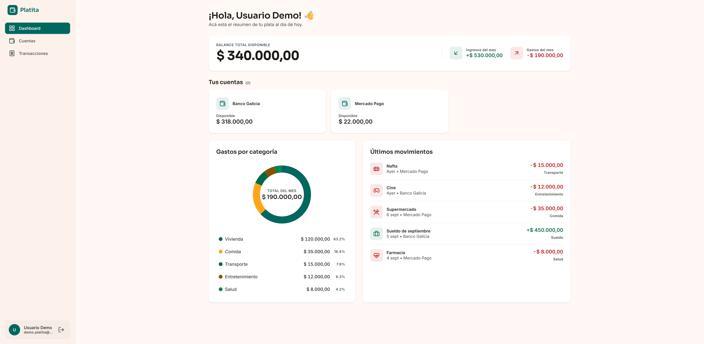
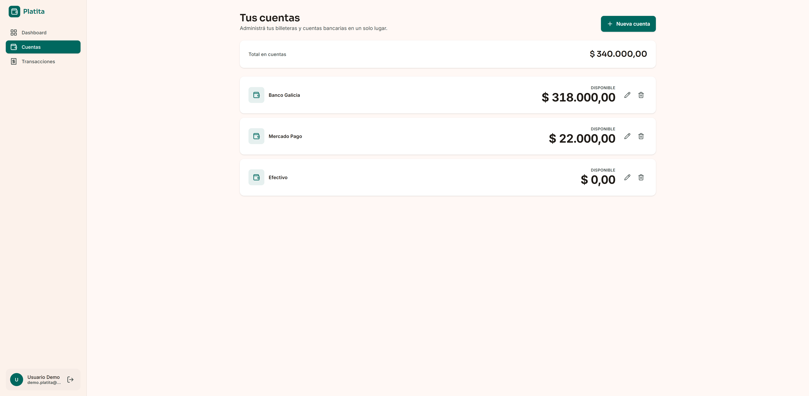
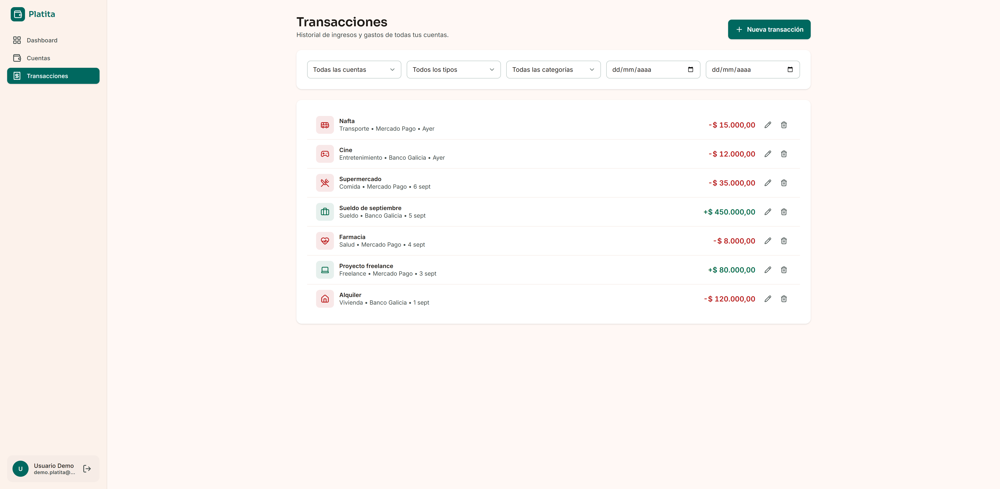

# Platita 💸

Gestor de finanzas personales simple y transparente. Permite registrar cuentas, cargar
ingresos y gastos, y ver de un vistazo cómo está tu plata: balance total, gastos por
categoría y últimos movimientos.

Proyecto con foco en un modelo de datos relacional bien diseñado y un flujo de autenticación
completo (no en cobertura de features).

## Capturas

| Dashboard | Cuentas |
|---|---|
|  |  |

| Transacciones | Iniciar sesión |
|---|---|
|  |  |

## Features

- Registro/login con JWT y passwords hasheadas (bcrypt)
- Múltiples cuentas por usuario (banco, billetera virtual, efectivo)
- Carga de ingresos y gastos con categorías predefinidas
- Dashboard con balance total, ingresos/gastos del mes y gastos por categoría
- Todos los endpoints protegidos filtran por el usuario del token — nunca se recibe
  `userId` desde el cliente

## Stack

**Frontend:** React 18 + TypeScript + Vite, Tailwind CSS, Motion, Lucide React
**Backend:** Node.js + Express 5 + TypeScript, Prisma ORM 7, PostgreSQL (Neon), JWT + bcryptjs, Zod
**Infra:** Backend en Render, Frontend en Vercel

## Estructura

```
platita/
├── backend/    API REST (Express + Prisma)
├── frontend/   SPA (React + Vite)
├── mockups/    Referencias visuales de diseño
└── design.md   Sistema de diseño
```

## Correr el proyecto localmente

### Backend
```bash
cd backend
npm install
cp .env.example .env   # completar DATABASE_URL y JWT_SECRET
npm run prisma:migrate
npm run prisma:seed
npm run dev             # http://localhost:3000
```

### Frontend
```bash
cd frontend
npm install
cp .env.example .env    # VITE_API_URL=http://localhost:3000/api
npm run dev              # http://localhost:5173
```

## API

```
POST   /api/auth/register
POST   /api/auth/login
GET    /api/auth/me              🔒

GET    /api/accounts             🔒
POST   /api/accounts             🔒
PATCH  /api/accounts/:id         🔒
DELETE /api/accounts/:id         🔒

GET    /api/categories           🔒  (?type=income|expense)

GET    /api/transactions         🔒  (?accountId=&categoryId=&type=&from=&to=)
GET    /api/transactions/:id     🔒
POST   /api/transactions         🔒
PATCH  /api/transactions/:id     🔒
DELETE /api/transactions/:id     🔒

GET    /api/dashboard/summary        🔒
GET    /api/dashboard/by-category    🔒  (?month=&year=)
```

Respuestas con el formato `{ success: true, data }` / `{ success: false, error }`.

## Modelo de datos

`User` 1→N `Account` 1→N `Transaction` N→1 `Category` (predefinida, seedeada).
Los montos se guardan como `Decimal` (nunca `Float`) para evitar errores de redondeo.
El balance de cada cuenta se calcula al vuelo, sumando sus transacciones.

Ver el detalle completo en [`backend/src/prisma/schema.prisma`](backend/src/prisma/schema.prisma).
